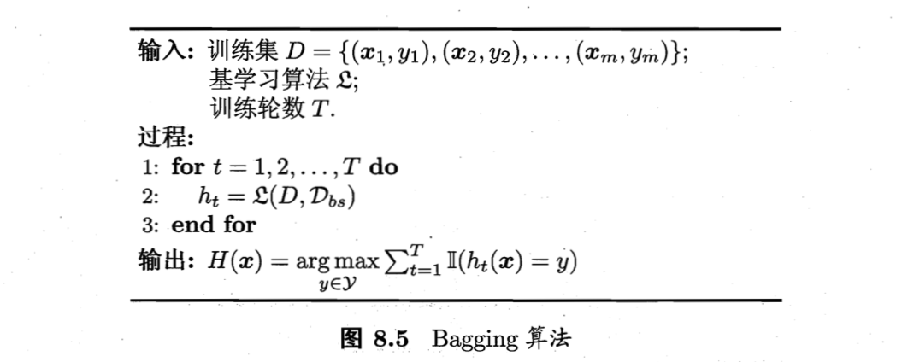
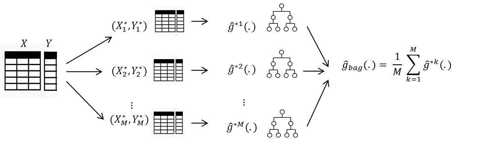

```{r setup, include=FALSE}
knitr::opts_chunk$set(echo = TRUE)
```

## Reference

1. [chap 08 - 集成学习 | Ensemble learning](https://octemull.github.io/personal-site/post/ml-chap08/)


1. [Bagging : an ensemble method for variance reduction in unstable models](https://rpubs.com/nurakawa/bagging)


1. [Bagging = Bootstrap + Aggregating](https://rpubs.com/maulikpatel/229368)

1. [R筆記 – (16) Ensemble Learning(集成學習)](https://rpubs.com/skydome20/R-Note16-Ensemble_Learning)


## Algorithm



$$ D_{bs}:Distribution\ after \ bootstrap $$


$$ OOB: Out\ of\ bag, about\ 36.8\% \ would\ not\ be\ selected\ by\ bootstrap\ sample, used\ to\ estimate\ true\ error\ rate. $$



---

## Package

```{r message=FALSE, warning=FALSE}
library(dplyr) # data manipulation
library(magrittr) # %<>%
library(adabag) # bagging
source('Source_Bagging.R') # ModelPerformance
```


----


# Modeling

## Setting

```{r}
data <- iris
formula <- formula(Species ~ .)

mfinal = 20 # the number of trees to use
para_calc = FALSE ## parallel calc. 

control.Tree <- rpart::rpart.control(
          minsplit = 15, # min obs. in node --- too small cause over-fitting
          minbucket = 1, # min obs. in leaf--- too small cause over-fitting
          cp = 0, # complex parameter --- too small cause over-fitting
          # xval = 10, # cross validation
          maxdepth = 30, # The root node counted as depth 0
          maxcompete = 4, 
          maxsurrogate = 5, 
          usesurrogate = 2, 
          surrogatestyle = 0)

```

## Model

This bagging algorithm proposed by Breiman in 1996 using classification trees as single classifiers.

```{r}
# Function bagging include bootstrap process, we needn't to partition data ourselves.

model.Bagging <- bagging(
        formula = formula,
        data = data,
        mfinal = mfinal, # the number of trees to use
        control = control.Tree,
        par = para_calc # parallel calc.  
        )

# Dont print "model.Bagging" directly because it contains too much trees info.


## importance
model.Bagging$importance


## Bootstrap Samples
# model.Bagging$samples
```

## Predict

```{r}
pred.Bagging <- predict.bagging(model.Bagging, 
                                newdata = data)

pred.Bagging$class

pred.Bagging$confusion

pred.Bagging$error


```

