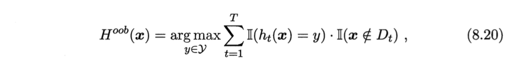

```{r setup, include=FALSE}
knitr::opts_chunk$set(echo = TRUE)
```

## Reference

1. [chap 08 - 集成学习 | Ensemble learning](https://octemull.github.io/personal-site/post/ml-chap08/)


1. [Bagging : an ensemble method for variance reduction in unstable models](https://rpubs.com/nurakawa/bagging)


1. [Bagging = Bootstrap + Aggregating](https://rpubs.com/maulikpatel/229368)

## Algorithm


$$ D_{bs}:Distribution\ after \ bootstrap $$



$$ OOB: Out\ of\ bag, about\ 36.8\% \ would\ not\ be\ selected\ by\ bootstrap\ sample, used\ to\ estimate\ true\ error\ rate. $$


---

## Package

```{r}
library(dplyr) # data manipulation
library(magrittr) # %<>%
library(adabag) # bagging
source('Source_Bagging.R') # ModelPerformance
```

## Data

Source : [UCI : Spambase Data Set](https://archive.ics.uci.edu/ml/datasets/spambase)

### Raw Data
```{r message=FALSE, warning=FALSE}

SpamBase <-  read.csv('https://archive.ics.uci.edu/ml/machine-learning-databases/spambase/spambase.data', header = FALSE)

DT::datatable(SpamBase)
```


### Summary

```{r}
SpamBase.Names <-  readLines('https://archive.ics.uci.edu/ml/machine-learning-databases/spambase/spambase.names')

SpamBase.Names
```


### Colname


```{r}
# SB_colname <- c(
#   'word_freq_make',
#   'word_freq_address',
#   'word_freq_all',
#   'word_freq_3d',
#   'word_freq_our',
#   'word_freq_over',
#   'word_freq_remove',
#   'word_freq_internet',
#   'word_freq_order',
#   'word_freq_mail',
#   'word_freq_receive',
#   'word_freq_will',
#   'word_freq_people',
#   'word_freq_report',
#   'word_freq_addresses',
#   'word_freq_free',
#   'word_freq_business',
#   'word_freq_email',
#   'word_freq_you',
#   'word_freq_credit',
#   'word_freq_your',
#   'word_freq_font',
#   'word_freq_000',
#   'word_freq_money',
#   'word_freq_hp',
#   'word_freq_hpl',
#   'word_freq_george',
#   'word_freq_650',
#   'word_freq_lab',
#   'word_freq_labs',
#   'word_freq_telnet',
#   'word_freq_857',
#   'word_freq_data',
#   'word_freq_415',
#   'word_freq_85',
#   'word_freq_technology',
#   'word_freq_1999',
#   'word_freq_parts',
#   'word_freq_pm',
#   'word_freq_direct',
#   'word_freq_cs',
#   'word_freq_meeting',
#   'word_freq_original',
#   'word_freq_project',
#   'word_freq_re',
#   'word_freq_edu',
#   'word_freq_table',
#   'word_freq_conference',
#   'char_freq_;',
#   'char_freq_(',
#   'char_freq_[',
#   'char_freq_!',
#   'char_freq_$',
#   'char_freq_#',
#   'capital_run_length_average',
#   'capital_run_length_longest',
#   'capital_run_length_total',
#   'is_spam'
# )
# 
# 
# colnames(SpamBase) <- SB_colname
# 
# # Check Column Name 
# SpamBase %>% head() %>% DT::datatable()
```


### Missing Value

```{r}
# Check SpamBase.Names first, missing value may be altered to other sign. 

# Missing Value Num
SpamBase %>% is.na() %>% sum()

```


----


# Modeling

## Setting

```{r}
data_bagging <- SpamBase
formula_bagging <- formula(V58 ~ .)


control.Tree <- rpart::rpart.control(
          minsplit = 15, # min obs. in node --- too small cause over-fitting
          minbucket = 1, # min obs. in leaf--- too small cause over-fitting
          cp = 0, # complex parameter --- too small cause over-fitting
          xval = 10, # cross validation
          maxdepth = 30, # The root node counted as depth 0
          maxcompete = 4, 
          maxsurrogate = 5, 
          usesurrogate = 2, 
          surrogatestyle = 0)

```

## Model

```{r}
model.Bagging <- bagging(
        formula = formula_bagging,
        data = data_bagging,
        mfinal = 5, # the number of trees to use
        control = control.Tree,
        par = FALSE # parallel calc.  
        )

model.Bagging
```


